# MageOS_ClaudeConsumerAgent

A shopping assistant for Hyvä storefronts on Magento 2 and Mage-OS. It ports
Anthropic's open-source shopping agent to a Magento module: the assistant
searches the catalog, explains products, adds them to the cart, checks orders
and answers policy questions from the store's own data. Replies stream from
the Claude Messages API into a side panel on every page.

The module ships generic. It names no store, every backend call goes through
`Api\StorefrontBackendInterface`, and a store layer can replace or extend any
part without touching the base module.

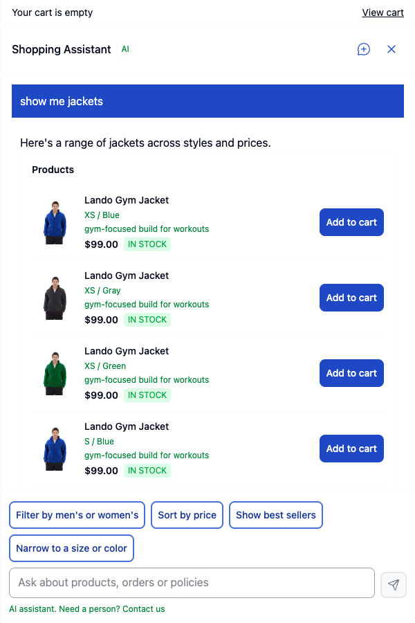

## What the customer gets

- A launcher button on every page that opens a panel on the right (or a
  bottom sheet on a phone). The transcript survives page changes and reloads.
  The assistant stays off the checkout steps and the order success page.
- Product search with real cards: image, price, stock, a one-line reason from
  the assistant, and Add to cart. Configurable products list their sizes and
  colours first, the assistant never picks a variant on its own.
- Cart actions with the store's own quote: add, remove, quantities, custom
  options. The header cart count updates at once.
- Answers about the current page: on a category page "what are the best
  sellers here" lists that category, on a product page "does this run small"
  talks about that product.
- Order status for logged-in customers, policy answers quoted from CMS pages,
  and store facts such as gift wrapping or price match from the admin.
- Suggestion chips above the message box, an AI label, and a "Need a person"
  link to a human.

| Start screen | Configurable product | Added to cart |
|---|---|---|
| 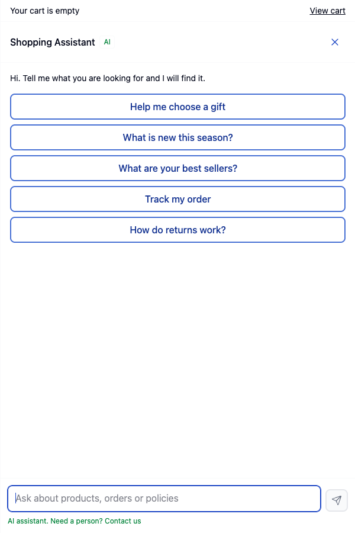 | 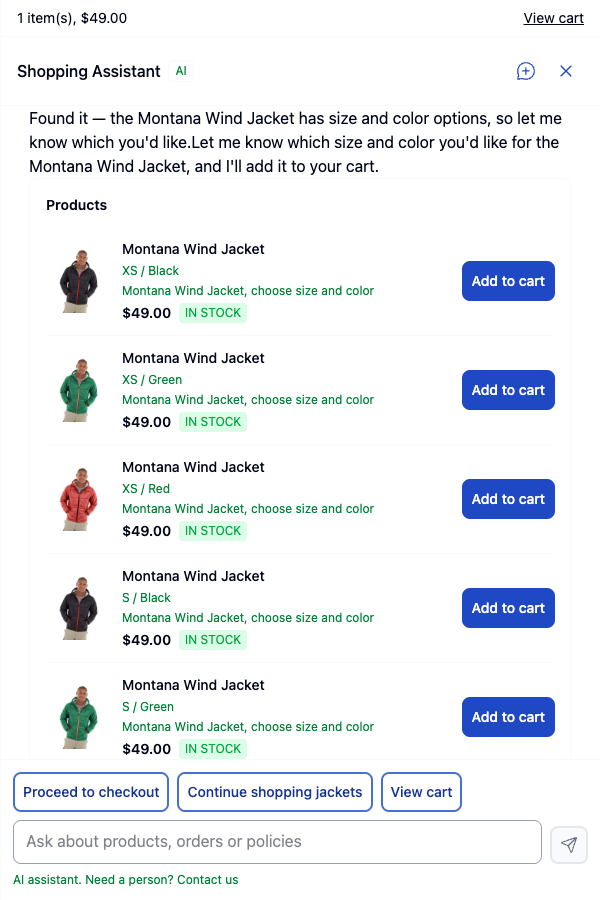 | 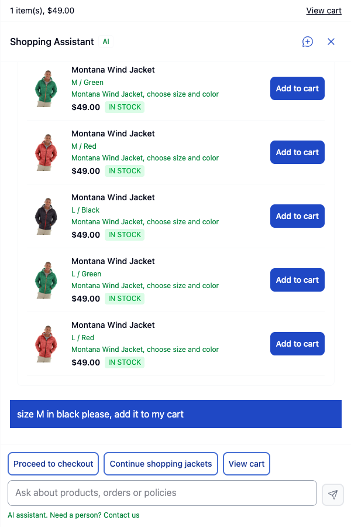 |

| Category page context | Store fact answer | Phone |
|---|---|---|
| 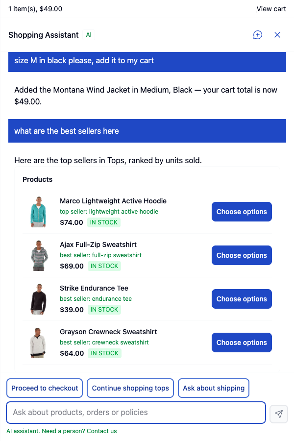 | 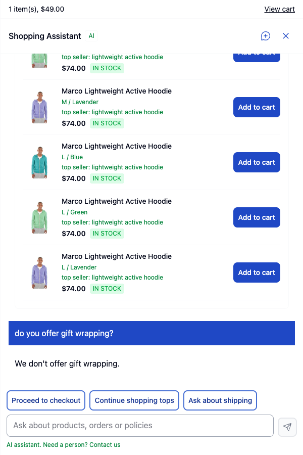 | 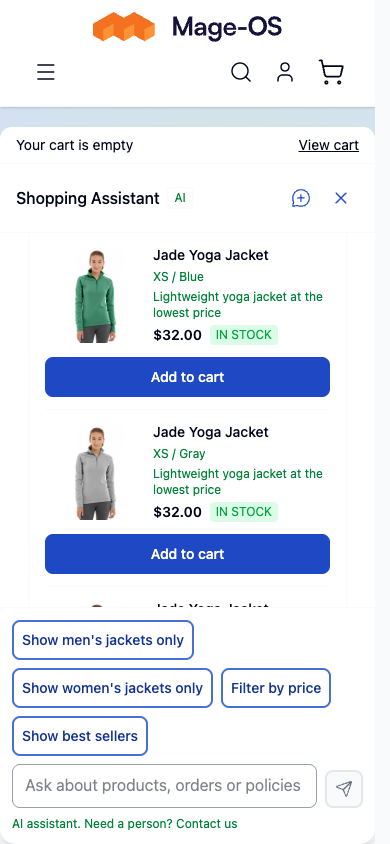 |

## Requirements

- PHP 8.1 to 8.5
- Magento 2.4 or Mage-OS 3.x with a Hyvä theme on Tailwind 4 (Hyvä default
  theme 1.5 or later). The module has no Luma templates.
- ext-intl, ext-json, guzzlehttp/guzzle 7.5 or later
- An Anthropic API key with access to the configured model

## Installation (development only)

The package is not on Packagist yet. Until then, clone it into `app/code`.

```bash
cd <magento root>
git clone git@github.com:mage-os-lab/module-claude-consumer-agent.git app/code/MageOS/ClaudeConsumerAgent
bin/magento module:enable MageOS_ClaudeConsumerAgent
bin/magento setup:upgrade
bin/magento hyva:config:generate
bin/magento setup:di:compile
```

Then rebuild the theme CSS. `hyva:config:generate` registers the module in
`app/etc/hyva-themes.json`, so the theme build scans the module's templates
and imports its Tailwind source on its own:

```bash
cd app/design/frontend/<Vendor>/<theme>/web/tailwind
npm ci
npm run build
```

Finish with `bin/magento cache:flush`. In production mode also run
`bin/magento setup:static-content:deploy`.

`setup:upgrade` creates three tables: `aiagent_session`, `aiagent_message`
and `aiagent_turn`. A composer install (`mageos/module-claude-consumer-agent`)
will replace the clone once the package is published.

## Configuration

Stores > Configuration > Sales > Shopping Assistant. Every field has default,
website and store view scope, so one install can run several store views with
their own name, voice, starters and limits. Config paths start with `aiagent/`.

### General

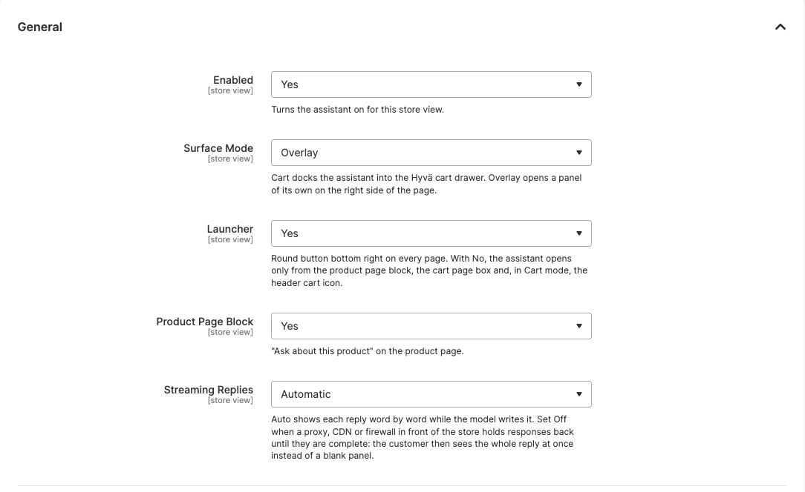

- Enabled: turns the assistant on for the scope.
- Surface Mode: Overlay opens a panel of its own. Cart docks the assistant
  into the Hyvä cart drawer, with a Header Icon View field that decides what
  the drawer opens with (cart, chat, or the last one used).
- Launcher: the round button bottom right. With No, the assistant opens only
  from the product page block, the cart page box and, in Cart mode, the header
  cart icon.
- Product Page Block: the "Ask about this product" button on product pages.
- Streaming Replies: Auto streams each reply word by word. Set Off when a
  proxy or CDN in front of the store buffers responses. See
  [Streaming](#streaming-and-the-json-fallback).

### Model

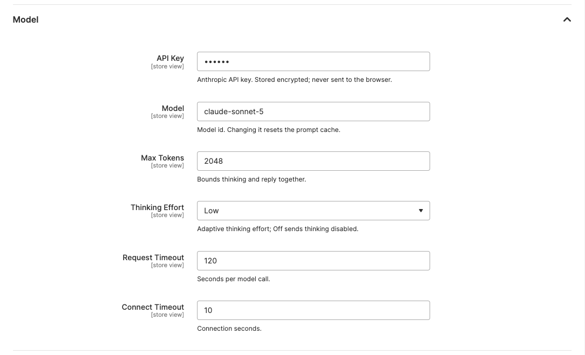

The API key is stored encrypted and never reaches the browser. Model id, max
tokens, thinking effort and timeouts live here. A model change resets the
prompt cache.

### Voice

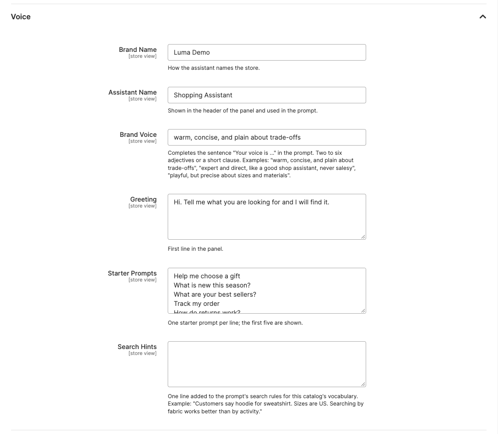

- Brand Name and Assistant Name: shown in the panel header and used in the
  prompt.
- Brand Voice: completes the sentence "Your voice is ..." in the prompt. Two
  to six adjectives or a short clause.
- Greeting and Starter Prompts: the first line and the buttons on the start
  screen (one per line, the first five are shown).
- Search Hints: one line added to the prompt's search rules for this catalog's
  vocabulary, for example "Customers say hoodie for sweatshirt. Sizes are US."

### Content

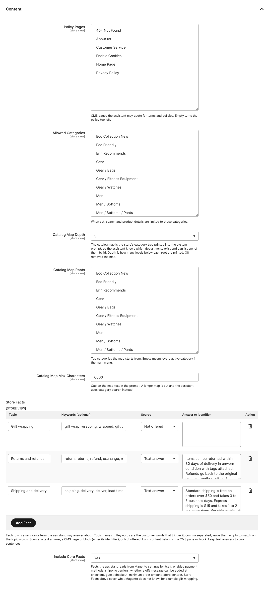

- Policy Pages: CMS pages the assistant may quote for terms and policies.
  Empty turns the policy tool off.
- Allowed Categories: limits search and product details to these categories.
- Catalog Map: the store's category tree printed into the system prompt, so
  the assistant knows which departments exist and can list any of them by id.
  Depth sets how many levels are printed, Roots which top categories start
  the map (empty means the main menu), Max Characters caps the text.
- Store Facts: one row per service or term the assistant may answer about.
  Topic names it. Keywords are the customer words that trigger it, comma
  separated; empty keywords match on the topic words. Source is a text
  answer, a CMS page or block (enter its identifier), or Not offered.
  Anything not listed is treated as not offered.
- Include Core Facts: facts read from Magento settings by itself: enabled
  payment methods, shipping carriers, gift messages at checkout, guest
  checkout, minimum order amount and store contact.

### Product Cards

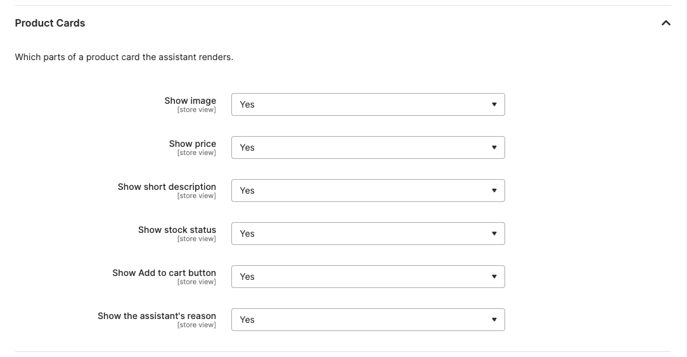

Yes/No toggles for each part of a product card: image, price, short
description, stock status, Add to cart button and the assistant's reason.

### Limits

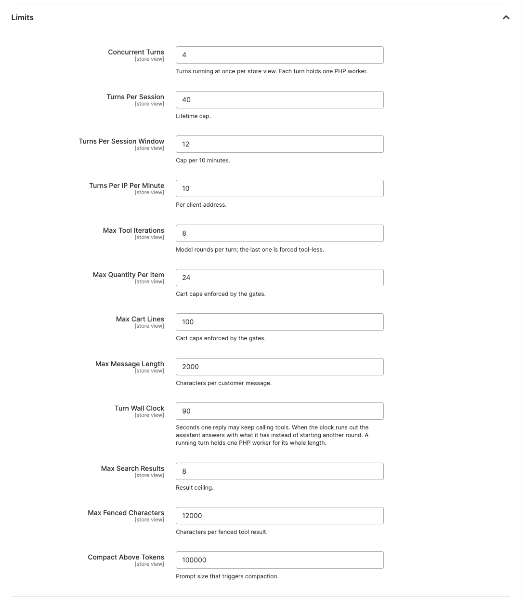

Caps on load and cost: concurrent turns per store view, turns per session and
per IP, tool rounds per turn, cart quantities and lines, message length,
search results, fenced characters and the prompt size that triggers
compaction. Turn Wall Clock is the number of seconds one reply may keep
calling tools; when it runs out the assistant answers with what it has.

A running turn holds one PHP-FPM worker for its whole length. Size the pool's
`pm.max_children` above `concurrent_turns x turn_wall_clock` seconds of held
workers for every store view on the pool, plus normal traffic.

### Privacy

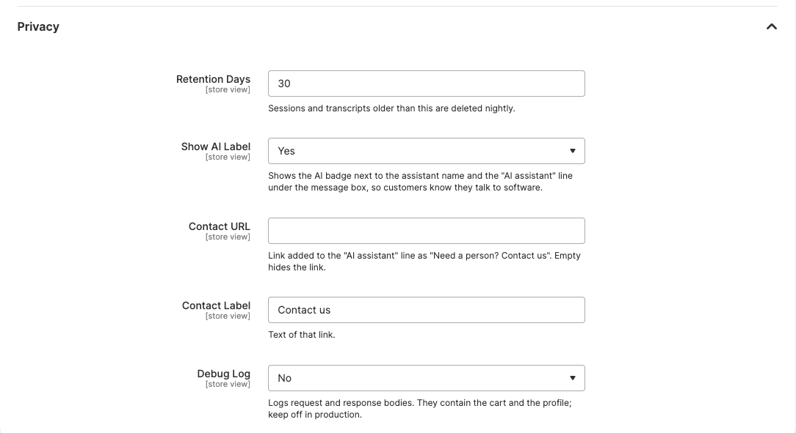

- Retention Days: sessions and transcripts older than this are deleted by the
  nightly cron `aiagent_retention`.
- Show AI Label: the AI badge next to the assistant name and the "AI
  assistant" line under the message box.
- Contact URL and Label: the "Need a person? Contact us" link on that line.
- Debug Log: writes full request and response bodies to `var/log/aiagent.log`.
  They contain the cart and the customer profile, keep it off in production.

### Hidden settings

These paths have defaults in `etc/config.xml` and no admin field. Set them
with `bin/magento config:set` when needed.

| Path | Default | Meaning |
|---|---|---|
| `aiagent/runtime/first_byte_threshold` | 4 | Seconds the browser waits for the first streamed byte before it switches the session to JSON replies |
| `aiagent/runtime/heartbeat_seconds` | 10 | Interval of `: ping` comments while a model call runs, keeps proxies from closing the idle connection |
| `aiagent/lexicon/policy_intent_terms` | word list | Words that force the policy tool |
| `aiagent/lexicon/order_intent_terms` | word list | Words that force the order lookup |

A store layer extends the lexicon lists through di.xml, see
[Extension points](#extension-points).

## How a turn works

1. The browser posts the message, the session id and the current page
   context to `POST /aiagent/turn/index` with the form key in the
   `X-Form-Key` header.
2. Grounding rules run before the model: a store fact keyword answers from
   the fact, a policy or order phrase forces that tool, a token in the
   message that matches an existing SKU forces a product read, and a first
   message on a product page reads that product.
3. The orchestrator calls the model with the static system prompt (voice,
   catalog map, store facts, tool list) and the session context (cart,
   customer, page). Tool calls run against the store through
   `Api\StorefrontBackendInterface`: `search_products`, `search_categories`,
   `get_product_details`, `add_to_cart`, `remove_from_cart`, `get_cart`,
   `get_orders`, `search_policies`, `get_fulfillment_options`, `load_skill`,
   and the presentation tools `present_products`, `present_comparison` and
   `present_suggestions`.
4. Gates check every cart write: a configurable product needs every option
   named by the customer in the conversation, a product with required custom
   options needs each of them, quantities and line counts stay under the
   limits. A refused write comes back to the model as a held outcome, so it
   asks instead of guessing.
5. Events stream to the browser: text deltas, tool status lines, cards,
   suggestion chips, then `turn_complete` with the token usage. The session,
   the messages and a turn log row are saved.

### Page context

Every request carries a `current_page` object: `page_type` (`home`,
`search`, `product`, `category`, `cart`, `orders` or `other`), `product_id`,
`query`, and for a category page `category_id` and `category_name`. The
server detects the page from the full action name
(`Model\Surface\PageDetector`); the browser only sniffs the DOM when the
server value is `other`. When the page changes between turns, a hidden
`[Page: ...]` note is prepended to the customer message so the model knows
where the customer is now.

### Catalog map

`Model\Agent\Prompt\CatalogMap` prints the category tree under a
`# Catalog map` heading in the static prompt, each entry with its
`category_id`, so the model can pass it to `search_products` as
`filters.category_id` or word a chip in the catalog's own vocabulary.
`search_categories` finds deeper categories by keyword. The map is rebuilt
when a category is saved, deleted or moved.

`search_products` accepts a query, a `category_id`, or both. `filters.sort`
takes `price_asc`, `price_desc` or `best_sellers`. Best sellers rank by units
sold over the last two years from `sales_bestsellers_aggregated_yearly`, with
configurable children folded into their parents
(`Api\Backend\BestsellerRankInterface`).

### Custom options

Core Magento custom options are part of every product record
(`custom_options` with title, type, required flag and values). The model sets
them through `add_to_cart` as `options {"<option title>": "<value title>"}`.
Drop-down, radio, checkbox, multi-select, text and textarea options work in
the panel. File, date and time options hand the customer off to the product
page, the card shows Choose options instead of Add to cart.

## Streaming and the JSON fallback

`POST /aiagent/turn/index` streams Server-Sent Events by default: a `: open`
comment within milliseconds, one frame per event
(`event: <type>\ndata: <json>\n\n`), periodic `: ping` heartbeats, then
`event: turn_complete`. A client can also send `{"stream": 0}` and receive
the same events as one JSON body after the turn finishes.

A buffering proxy defeats SSE: the browser sees nothing until the whole
response lands. Checks and fixes:

- nginx: `proxy_buffering off;` and `gzip off;` (or exclude the route) on the
  `aiagent` location, and do not `fastcgi_finish_request` early
- Apache with mod_proxy_fcgi: disable `SetOutputFilter` gzip on this route
  and confirm `flush` is on for the proxy handler
- Any compression filter holds the whole stream before it flushes

The browser switches a session to JSON replies on its own when the first byte
takes longer than `first_byte_threshold` seconds. If the proxy cannot be
fixed, set Streaming Replies to Off.

Health check from the server, through the proxy:

```bash
curl -N -s -X POST https://<store>/aiagent/turn/index \
  -H 'Content-Type: application/json' -H 'X-Form-Key: <form key>' \
  -H 'Cookie: PHPSESSID=<session>; form_key=<form key>' \
  --data '{"session":null,"message":"hello","page":{"type":"home"},"stream":1}'
```

Expect `: open` within 200 ms, then event frames, then `event: turn_complete`.
A body that arrives all at once after several seconds means a buffering
proxy, not a Magento cache problem.

## Commands

- `aiagent:spike:stream [--store=<code>] [--message="..."] [--product=<id>]
  [--record=<name>] [--raw]`: runs one turn through the real orchestrator,
  client and backend on a throwaway session and prints text, tool calls,
  rendered components, usage and elapsed time. `--raw` streams the Messages
  client directly to verify the transport. `--record` writes the SSE frames
  as fixtures.
- `aiagent:eval:run [--cases=<dir>] [--filter=<glob>] [--live]
  [--store=<code>] [--json]`: replays the scripted conversations under
  `Test/Eval/cases` and grades tool calls, components and cart state. Without
  `--live` an in-memory backend serves every tool call. Exits 1 when a
  critical or high priority case fails.
- `aiagent:usage:report [--days=<n>] [--store=<id>]`: token usage per day and
  totals from `aiagent_turn`, with averages per turn and per session.
- `aiagent:session:purge [--older-than=<days>] [--customer=<id>] [--all]
  [--dry-run] [--force]`: deletes sessions and their messages.

## Logging and privacy

`var/log/aiagent.log` gets one INFO line per model call (round, model, stop
reason, token counts, elapsed time), INFO lines on limits (`busy`,
`limit ... kind=window`) and WARNING lines on tool failures, version
conflicts and retries. The session id is never logged: it is also the request
credential.

The transcript tables hold full conversation content, including fenced tool
results. `aiagent/privacy/retention_days` bounds their life, the nightly cron
deletes older sessions and `aiagent:session:purge` is the manual escape
hatch. `aiagent_turn` keeps one row per turn with the four usage fields the
API reports (input, output, cache write, cache read), duration and stop
reason. No dollar amounts are computed anywhere.

## Lazy loading

Every page carries the config store (`js/store.phtml`), the launcher and,
where enabled, the product and cart ask buttons. The panel, the drawer, the
transcript, the composer and every card sit inside `<template
data-ai-agent-shell>` elements and never initialise on page load.
`Alpine.store('aiAgent').mount()` loads `view/frontend/web/js/aiagent.js`
once, clones the shells into the document and initialises them the first
time the assistant opens.

A store layer that adds a card through
`Api\Presentation\PresentationExtensionInterface` registers its own Alpine
component the same way `aiagent.js` registers the built-in ones.

## Extension points

A store layer adds behaviour through interfaces and DI pools, never through a
preference on a base concrete class.

1. Backend swap per method group. `Model\Backend\MagentoStorefront`
   delegates to one interface per method group; replace one with a
   preference:

   ```xml
   <preference for="MageOS\ClaudeConsumerAgent\Api\Backend\SearchProviderInterface"
               type="Vendor\Store\Model\Backend\Provider\CatalogSearch"/>
   ```

   The same works for `CatalogMapProviderInterface` (the category tree the
   map is built from), `CategorySearchProviderInterface` (the
   `search_categories` tool), `BestsellerRankInterface` (the best sellers
   order) and `ProductOptionsProviderInterface` (custom options).

2. Tools. `Api\Tool\ToolProviderInterface` items pool on
   `Model\Agent\Tool\Registry`:

   ```xml
   <type name="MageOS\ClaudeConsumerAgent\Model\Agent\Tool\Registry">
       <arguments>
           <argument name="providers" xsi:type="array">
               <item name="store" xsi:type="object">Vendor\Store\Model\Tool\StoreToolProvider</item>
           </argument>
       </arguments>
   </type>
   ```

3. Cards. `Api\Presentation\PresentationExtensionInterface` items pool on
   `Model\Agent\Presentation\Registry` the same way, under
   `<argument name="extensions">`.

4. Prompt and lexicon. `Model\Agent\Lexicon` and `Model\Agent\Skill\Loader`
   take array arguments merged with the config values and the built-in
   skill directory:

   ```xml
   <type name="MageOS\ClaudeConsumerAgent\Model\Agent\Lexicon">
       <arguments>
           <argument name="additionalPolicyTerms" xsi:type="array">
               <item name="0" xsi:type="string">warranty claim</item>
           </argument>
       </arguments>
   </type>
   ```

5. Cart writes. `Api\Cart\BuyRequestBuilderInterface` builds the
   `DataObject` that `Quote::addProduct()` receives; replace it or decorate
   it with a plugin.

6. Templates. Every surface and card template resolves through the normal
   theme fallback: override by path in a child theme under
   `MageOS_ClaudeConsumerAgent/templates/`.

7. Config. `Model\Config\StoreConfig::agent()` resolves every field at store
   view scope. A store layer adds fields under its own section and reads them
   itself.

## Tests

- Unit: `vendor/bin/phpunit -c dev/tests/unit/phpunit.xml.dist app/code/MageOS/ClaudeConsumerAgent/Test/Unit`
  (no Magento bootstrap, no database)
- Integration: `Test/Integration` with the project's integration test
  configuration
- Evals: `bin/magento aiagent:eval:run` (scripted conversations, see
  Commands)

## License

Open Software License (OSL) 3.0, see `LICENSE`.
